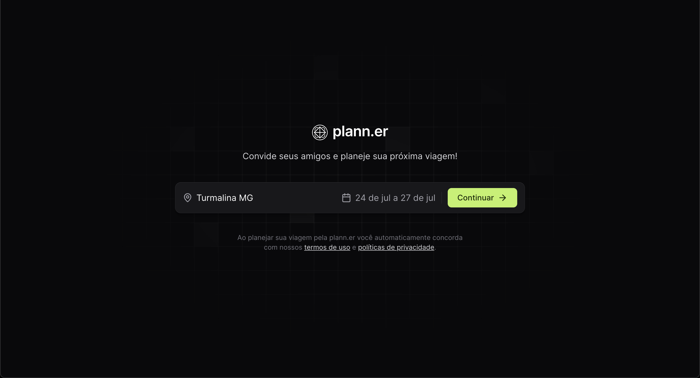
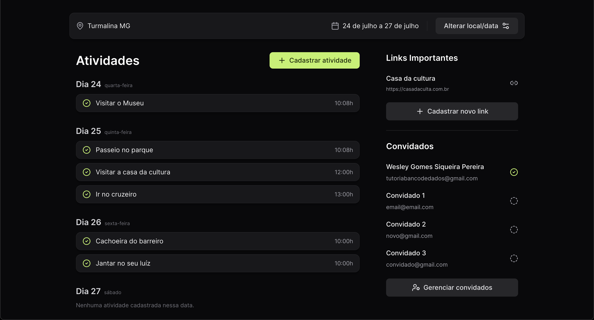
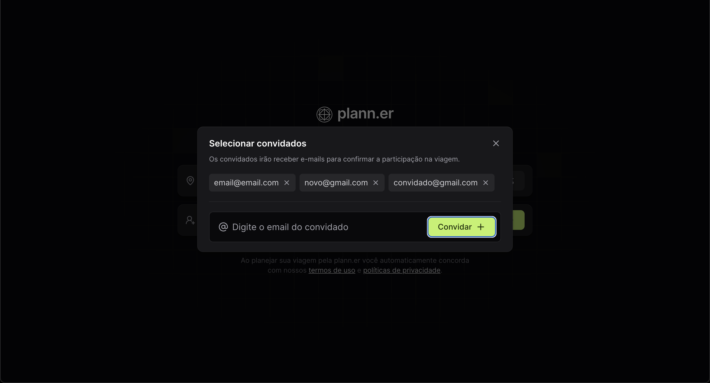

# Plann.err

Plann.err é uma aplicação de planejamento de viagens construída com React. Ela permite aos usuários planejar viagens, convidar amigos, criar atividades, gerenciar links importantes e confirmar os detalhes da viagem.

## Funcionalidades

- **Criar uma Viagem:** Adicione um destino e selecione as datas para a sua viagem.
- **Convidar Amigos:** Envie convites para um ou vários amigos via email.
- **Criar Atividades:** Planeje atividades para fazer durante a viagem.
- **Adicionar Links Importantes:** Salve links importantes relacionados à sua viagem.
- **Confirmar Viagem:** Confirme os detalhes da sua viagem com seu nome e email.
- **Gerenciar Convidados:** Gerencie a lista de convidados para a sua viagem.
- **Editar Viagem:** Faça alterações nos detalhes da sua viagem conforme necessário.

## Prints do projeto:
#### Home do site


## Detalhes da viagem:

### Convidar amigos:


## Instalação

Para começar a usar o Plann.err, siga estes passos:

1. **Clone o repositório:**
    ```bash
    git clone git@github.com:wesley-gomes-sje/plann.er.git
    cd plann.er
    ```

2. **Instale as dependências:**
    ```bash
    npm install
    ```

3. **Inicie o servidor de desenvolvimento:**
    ```bash
    npm run dev
    ```

    Isso iniciará a aplicação em `http://localhost:5173`.

## Uso

### Criando uma Viagem

1. Insira o destino e selecione as datas de início e término.
2. Clique em "Continuar" para criar sua viagem.

### Convidando Amigos

1. Clique no input: "Quem estará na viagem?"
2. Insira os endereços de email dos seus amigos e clique em "Convidar".
3. Depois clique em "Confirmar Viagem"

### Confirmar criação da viagem

1. Insira seu nome completo e email para confirmar a viagem.
2. Clique em "Confirmar criação da viagem"

### Criando Atividades

1. Na página de detalhes da sua viagem, clique em "Cadastrar atividade".
2. Insira os detalhes da atividade e sua data, e clique em "Salvar atividade".

### Adicionando Links Importantes

1. Na página de detalhes da sua viagem, clique em  "Cadastrar novo link".
2. Insira os detalhes do link e clique em "Salvar Link".


### Gerenciando Convidados

1. Vá para a página de detalhes da sua viagem, clique em "Gerenciar convidados"
2. Você pode adicionar um novo convidado.

### Editando Sua Viagem

1. Na página de detalhes da sua viagem clique em "Alterar local/data"
2. Você pode alterar o destino e as datas da viagem.
3. Clique em "Salvar alterações".

## Contribuindo

Se você deseja contribuir com o Plann.err, siga estas diretrizes:

1. **Faça um fork do repositório.**
2. **Crie um novo branch para a sua funcionalidade ou correção de bug:**
    ```bash
    git checkout -b minha-branch-de-feature
    ```
3. **Faça suas alterações e as comite:**
    ```bash
    git commit -m "Adiciona alguma funcionalidade"
    ```
4. **Envie para o branch:**
    ```bash
    git push origin minha-branch-de-feature
    ```
5. **Crie um pull request.**

## Licença

Este projeto está licenciado sob a Licença MIT. Veja o arquivo [LICENSE](LICENSE) para mais detalhes.
